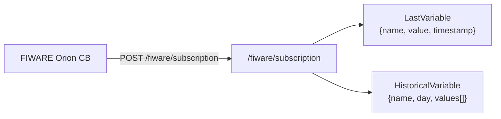

# FIWARE API

**Router prefix**: `/fiware`  
**Tag**: `fiware`

---

## Role of this router

The `/fiware/subscription` endpoint is a **webhook receiver**. FIWARE Orion Context Broker calls it when it detects changes in subscribed context entities. The endpoint persists the incoming values to `LastVariable` and `HistoricalVariable` in MongoDB.

This endpoint is **not** called by the frontend. It is registered with Orion as a subscription callback by the `OPCtoFIWARE` background task.

---

## Endpoints

### POST `/fiware/subscription`

Receives NGSI v2 notify payloads from Orion Context Broker.

**Role required**: none (webhook, called by Orion directly)

**Request body** (NGSI v2 notification format):

```json
{
    "data": [
        {
            "id": "Device1-Slave1",
            "type": "Device",
            "OutletTemp": {
                "value": 42.5,
                "type": "Number",
                "metadata": {
                    "timestamp": {
                        "type": "ISO8601",
                        "value": "2024-06-01T10:30:00.000Z"
                    }
                }
            }
        }
    ]
}
```

**Processing logic**:

For each attribute in each entity (excluding `id` and `type`), the endpoint:

1. Constructs the variable name as `{entity_id}-{attr_name}` (e.g. `Device1-Slave1-OutletTemp`).
2. Runs two writes in parallel via `asyncio.gather`:
    - `save_last_variable` — upserts the `LastVariable` document.
    - `save_historical_variable` — appends a `ValueWithTimestamp` to the `HistoricalVariable` document for today's date (creates the document if it does not exist).

**Response `200`**:

```json
{"status": "ok"}
```

---

## Data persistence flow



The `LastVariable` document is read by the Dashboard. The `HistoricalVariable` documents are queried by the Charts page.
