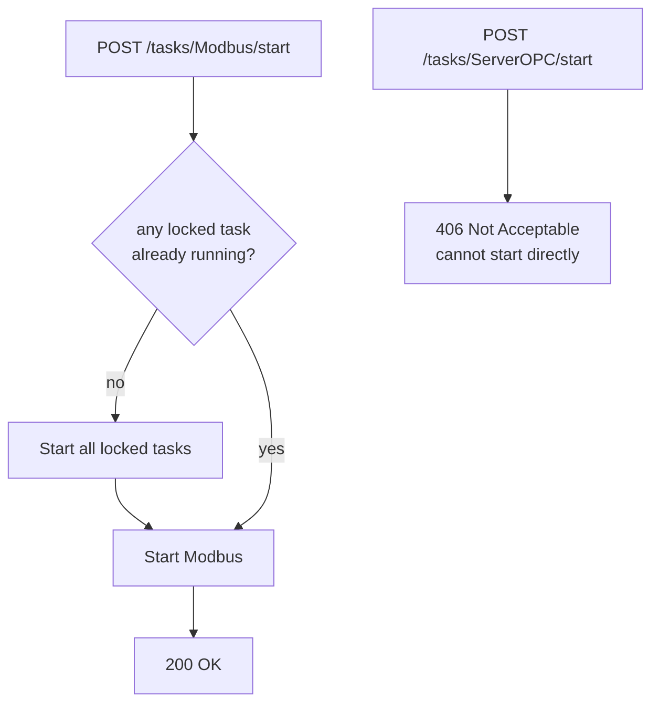

# Tasks API

**Router prefix**: `/tasks`  
**Tag**: `tasks`

---

## Task names

The `{name}` path parameter must be one of:

| Value | Task |
|---|---|
| `Modbus` | Modbus polling task |
| `ServerOPC` | OPC UA server task |
| `OPCtoFIWARE` | OPC UA → FIWARE bridge task |

---

## Endpoints

### POST `/tasks/{name}/start`

Starts a background task.

**Role required**: `Administrator`

**Behaviour by task type**:

- **Modbus** (unlocked): starts immediately. If no locked task is running it also auto-starts all locked tasks (`ServerOPC` and `OPCtoFIWARE`).
- **ServerOPC / OPCtoFIWARE** (locked): cannot be started directly — returns `406`. They are always started as dependencies of the Modbus task.



**Responses**:

| Status | Description |
|---|---|
| `200` | Task started (or already running) |
| `406` | Locked task — cannot start directly |
| `406` | Task does not exist |
| `422` | Script file not found on disk |

---

### POST `/tasks/{name}/stop`

Stops a background task.

**Role required**: `Administrator`

**Behaviour**:

- **Modbus** (unlocked): stops Modbus. If no other unlocked task remains running, also stops all locked tasks (`ServerOPC`, `OPCtoFIWARE`).
- **ServerOPC / OPCtoFIWARE** (locked): cannot be stopped directly — returns `406`.

**Responses**:

| Status | Description |
|---|---|
| `200` | Task stopped |
| `406` | Task already stopped |
| `406` | Locked task — cannot stop directly |
| `400` | Task has failed (PID died unexpectedly) |
| `404` | Task does not exist |

---

### GET `/tasks/{name}/state`

Returns the current state of a task.

**Role required**: `Administrator`

**Response `200`** (`TaskState`):

```json
{
    "state": "running",
    "locked": false
}
```

State values: `running` · `stopped` · `failed`

!!! note "Failure detection"
    If the stored state is `running` but `psutil` finds the PID is dead or a zombie, the state is automatically updated to `failed` before returning.

---

### WebSocket `/tasks/ws/log/{log_task}`

Streams the last 30 lines of a task's log file every second.

**Authentication**: after connecting, the client must immediately send a JSON message:

```json
{"token": "<access_token>"}
```

If the token is missing, invalid, or the user is not an Administrator, the server closes the connection with code `1008`.

**Log task values**: `Modbus` · `ServerOPC` · `OPCtoFIWARE`

**Message format**: each message is an HTML string of `<br/>`-separated log lines. `ERROR` lines are wrapped in a red `<span>`, `WARNING` lines in a yellow `<span>`.

**Log file paths** (inside the backend container):

| Task | Path |
|---|---|
| `Modbus` | `tasks/logModbus/Modbus.log` |
| `OPCtoFIWARE` | `tasks/logOPCtoFIWARE/OPCtoFIWARE.log` |
| `ServerOPC` | `tasks/logServer/ServerOPC.log` |
