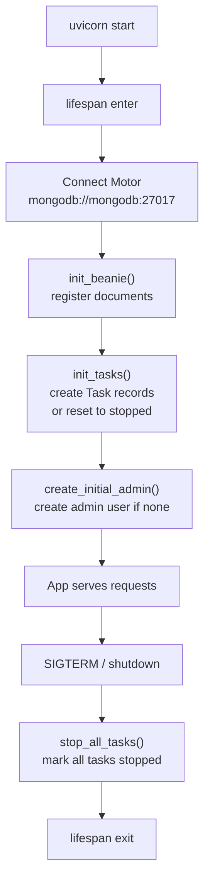
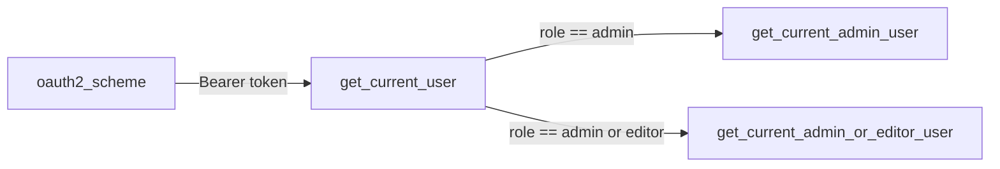

# Backend Architecture

The backend is a **FastAPI** application (Python 3.11) that uses **Beanie** as an async ODM over **MongoDB**. It is the single source of truth for all configuration, user accounts, task state, and time-series data.

## Directory structure

```
agrync_backend/
├── main.py               # FastAPI app, lifespan, CORS, router registration
├── routers/
│   ├── auth.py           # /auth/* — login, refresh, register, logout
│   ├── user.py           # /users/* — CRUD, device assignment
│   ├── modbus.py         # /modbus/* — device/slave/variable CRUD + bulk import
│   ├── task.py           # /tasks/* — start/stop/state + WebSocket log stream
│   ├── opc.py            # /opc/* — write OPC UA variable value
│   ├── fiware.py         # /fiware/* — FIWARE context entity helpers
│   └── generic.py        # /generic/* — last values, historical data
├── models/
│   ├── user.py           # User document, UserForm, UserByToken, Role enum
│   ├── modbus.py         # ModbusDevice document + nested Slave/Variable models
│   ├── task.py           # Task document, NameTask, State enums
│   ├── generic.py        # GenericDevice, LastVariable, HistoricalVariable documents
│   ├── token.py          # Token, TokenData Pydantic models
│   ├── opc.py            # OPC input models
│   ├── taskOPC.py        # VariableWriteInput model
│   └── filters.py        # FiltersPayload, FilterMode for server-side table filtering
├── tasks/
│   ├── Modbus.py         # Modbus polling subprocess
│   ├── ServerOPC.py      # OPC UA server subprocess
│   └── OPCtoFIWARE.py    # OPC UA → FIWARE bridge subprocess
└── utils/
    ├── datetime.py       # time_at() helper (UTC datetime)
    └── password.py       # bcrypt hash + verify wrappers
```

## Application startup

FastAPI's `lifespan` context manager orchestrates startup and shutdown:



## Router registration

```python
# main.py
app.include_router(authentication_router)   # prefix=/auth
app.include_router(users_router)            # prefix=/users
app.include_router(modbus_router)           # prefix=/modbus
app.include_router(tasks_router)            # prefix=/tasks
app.include_router(opc_router)              # prefix=/opc
app.include_router(fiware_router)           # prefix=/fiware
app.include_router(generic_router)          # prefix=/generic
```

All routers are registered at `root_path="/api/v1"`.

## Dependency chain for route protection



Routes that are public (e.g. `POST /auth/login`) have no dependency. All other routes inject at least `get_current_user`.

## Database documents

| Document | Collection | Description |
|---|---|---|
| `User` | `users` | Account, role, device assignment |
| `ModbusDevice` | `modbusdevices` | Device with embedded slaves and variables |
| `Task` | `tasks` | One record per background task (3 total) |
| `GenericDevice` | `genericdevices` | Slave-level device abstraction with variable attributes |
| `LastVariable` | `lastvariables` | Most recent reading for each variable |
| `HistoricalVariable` | `historicalvariables` | Time-series readings |

`ModbusDevice` uses Beanie's embedded model pattern — slaves and variables are nested subdocuments, not separate collections.

## CORS

Allowed origins in the default configuration:

```python
origins = [
    "http://localhost",
    "http://localhost:8080",
    "http://localhost:5173",
]
```

All HTTP methods and headers are allowed. Credentials are enabled (required for the `refresh-Token` cookie).

## Interactive API docs

FastAPI generates OpenAPI documentation automatically, accessible at:

- **Swagger UI**: `http://localhost:8000/api/v1/docs`
- **ReDoc**: `http://localhost:8000/api/v1/redoc`
