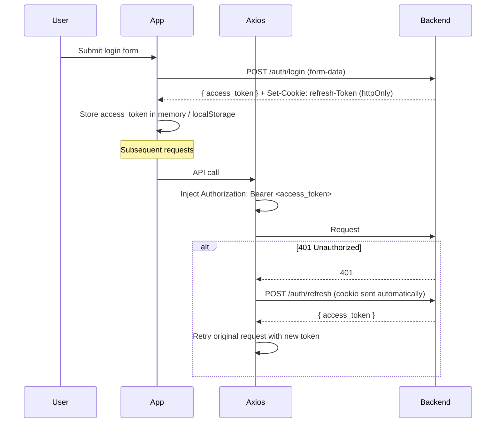
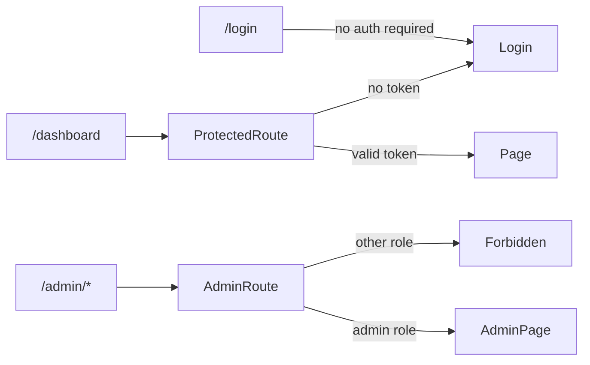

# Frontend Architecture

The frontend is a **React 18 + TypeScript** single-page application built with **Vite**. It communicates exclusively with the FastAPI backend via REST and WebSockets.

## Directory structure

```
agrync_frontend/src/
├── main.tsx              # React root, i18n provider, QueryClient provider
├── App.tsx               # Router definition, protected route wrappers
├── api/                  # Axios instance + per-domain API functions
├── components/           # Reusable UI components (forms, tables, modals, charts)
├── hooks/                # Custom React hooks (auth, queries, mutations)
├── i18n/                 # i18next configuration and translation files
├── layouts/              # Shell layouts (sidebar, topbar navigation)
├── lib/                  # Shared utilities (date formatting, constants)
├── pages/                # Route-level page components
│   ├── Login.tsx
│   ├── Dashboard.tsx
│   ├── Charts.tsx
│   ├── Modbus/
│   │   ├── DevicesPage.tsx
│   │   ├── SlavesPage.tsx
│   │   └── VariablesPage.tsx
│   ├── Monitoring/
│   │   ├── ModbusTaskPage.tsx
│   │   ├── ServerOPCTaskPage.tsx
│   │   └── OPCtoFIWARETaskPage.tsx
│   ├── UserManagement.tsx
│   └── AccountSettings.tsx
├── types/                # TypeScript interfaces and enums
└── test/                 # Vitest unit test utilities and mocks
```

## Key libraries

| Library | Purpose |
|---|---|
| `react-router-dom` | Client-side routing and protected routes |
| `@tanstack/react-query` | Server state management (queries + mutations) |
| `axios` | HTTP client with interceptors for Bearer token injection and 401 handling |
| `highcharts` + `highcharts-react-official` | Interactive time-series charts |
| `i18next` + `react-i18next` | Internationalisation |
| `playwright` | E2E tests |
| `vitest` | Unit/component tests |

## Authentication flow in the frontend



## Route protection

Routes are wrapped in a `ProtectedRoute` component that checks for a valid access token. Routes that require the Administrator role have an additional `AdminRoute` wrapper that checks `user.role`.



## WebSocket log streaming

Task monitoring pages open a WebSocket to `ws://localhost:8000/api/v1/tasks/ws/log/{taskName}`. After connection, the frontend immediately sends a JSON message with the access token for server-side authentication:

```typescript
ws.send(JSON.stringify({ token: accessToken }));
```

The server then streams the last 30 log lines every second until the connection is closed.

## Build and dev commands

```bash
# Development server (hot reload)
npm run dev          # → http://localhost:5173

# Production build
npm run build        # output in dist/

# Unit tests (Vitest)
npm run test

# E2E tests (Playwright)
npx playwright test --config playwright.config.cjs
```
