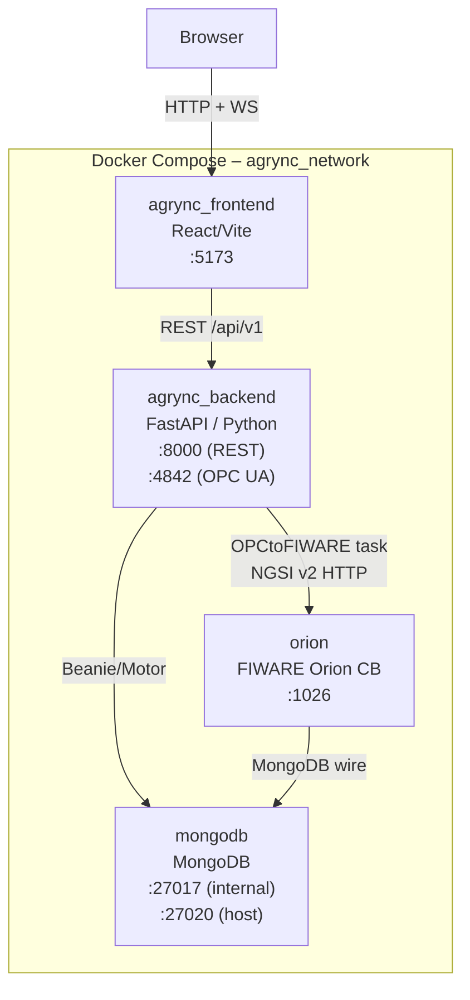
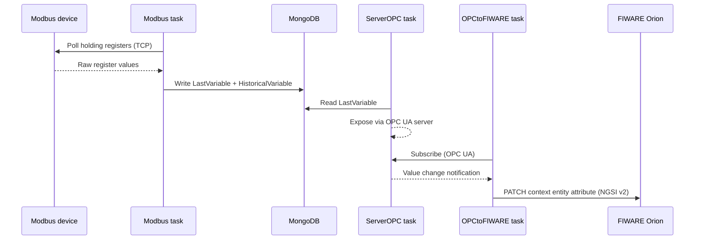

# System Overview

Agrync is deployed as four Docker containers connected on a shared bridge network (`agrync_network`). The diagram below shows the containers and the data flows between them.

## Container map



## End-to-end data flow



## Ports summary

| Host port | Container | Purpose |
|---|---|---|
| `5173` | agrync_frontend | React dev server (Vite) |
| `8000` | agrync_backend | FastAPI REST API |
| `4842` | agrync_backend | OPC UA server (asyncua) |
| `27020` | mongodb | MongoDB (host access) |
| `1026` | orion | FIWARE Orion Context Broker |

## API root path

All REST routes are prefixed with `/api/v1` (set via `root_path` in the FastAPI app). Example:

```
POST http://localhost:8000/api/v1/auth/login
```
