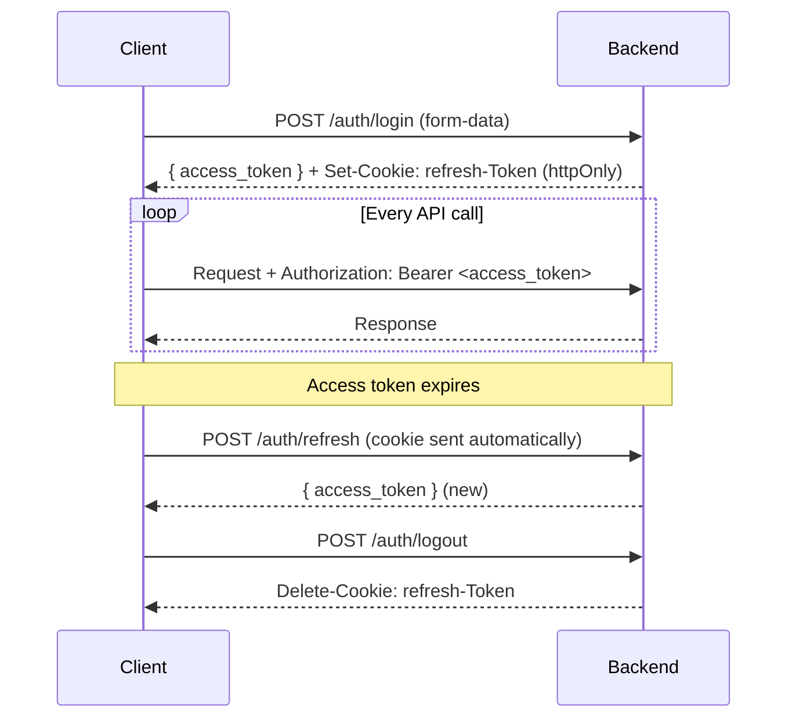
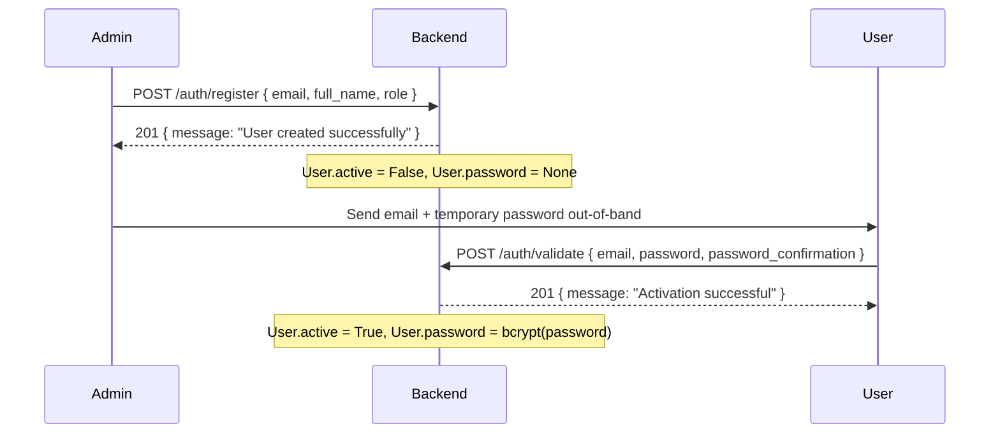

# Authentication & Security

## Authentication scheme

Agrync uses the **OAuth2 Password flow** with two JWT tokens:

| Token | Transport | Expiry | Secret env var |
|---|---|---|---|
| Access token | `Authorization: Bearer <token>` header | `ACCESS_TOKEN_EXPIRE_MINUTES` | `ACCESS_TOKEN_SECRET_KEY` |
| Refresh token | `refresh-Token` HttpOnly cookie | `REFRESH_TOKEN_EXPIRE_MINUTES` | `REFRESH_TOKEN_SECRET_KEY` |

Both tokens are signed JWTs (`python-jose`, algorithm configurable via `ALGORITHM` env var, default `HS256`). The `sub` claim contains the MongoDB ObjectId of the user.

---

## Token lifecycle



The refresh token is stored as an `HttpOnly`, `SameSite` cookie — it is never accessible from JavaScript in the browser.

---

## Password policy

Passwords are hashed with **bcrypt** via `passlib`:

```python
from passlib.context import CryptContext
pwd_context = CryptContext(schemes=["bcrypt"])
```

Rules enforced at `/auth/validate`:

- Minimum 8 characters.
- New password must differ from the current password (enforced at `/users/{id}/password`).

There is no maximum length limit enforced in code; bcrypt internally truncates at 72 bytes.

---

## Role-based access control

Three roles exist in the `Role` enum:

| Role value | Display | Permissions |
|---|---|---|
| `Administrador` | Administrator | Full access to all endpoints |
| `Editor` | Editor | Read access + write OPC UA variable values |
| `Lector` | Viewer | Reserved; not yet exposed in the UI |

### FastAPI dependency chain

```python
oauth2_scheme                          # extracts Bearer token
    └─► get_current_user               # decodes token, fetches User
            ├─► get_current_admin_user         # role == Administrador
            └─► get_current_admin_or_editor_user  # role in [Administrador, Editor]
```

Routes that do not appear in the dependency chain are public.

---

## Account activation flow

New users are created in an **inactive** state with no password. Activation is a two-step process:



An inactive user cannot log in — `authenticate_user` raises `401` if `active == False`.

---

## WebSocket authentication

The `/tasks/ws/log/{task}` WebSocket endpoint cannot use the HTTP `Authorization` header. After accepting the connection the server waits for a JSON message from the client:

```json
{"token": "<access_token>"}
```

If the token is missing, expired, or the user is not an Administrator the server closes the connection with code `1008`.

---

## Security checklist for production

- [ ] Rotate `ACCESS_TOKEN_SECRET_KEY` and `REFRESH_TOKEN_SECRET_KEY` — use long random strings (≥ 32 chars).
- [ ] Set `ALGORITHM` to `HS256` or stronger.
- [ ] Enable HTTPS (reverse proxy with TLS, e.g. Nginx + Let's Encrypt). The `HttpOnly` cookie only provides CSRF protection over HTTPS.
- [ ] Restrict `origins` in `CORSMiddleware` to your actual frontend domain.
- [ ] Rotate OPC UA certificates before they expire.
- [ ] Do not expose MongoDB port `27020` publicly.
