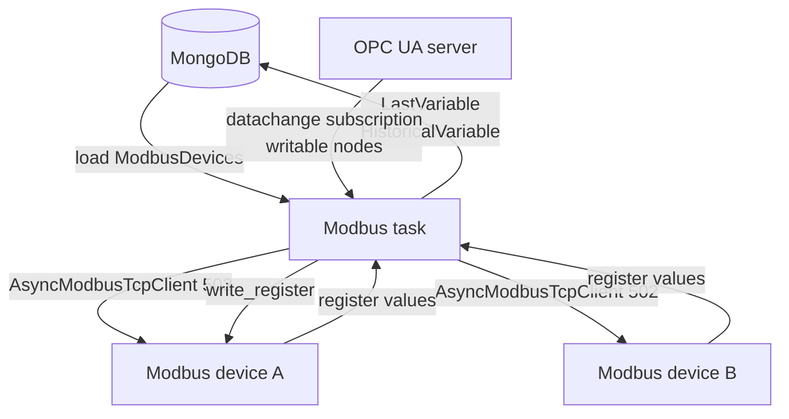

# Modbus Background Task

**Script**: `agrync_backend/tasks/Modbus.py`  
**Task name**: `Modbus`  
**Log file**: `tasks/logModbus/Modbus.log`  
**Locked**: `False` (can be started/stopped directly)

---

## Responsibilities

1. Connects to each configured Modbus TCP device at port `502`.
2. Polls holding registers for every variable on the per-variable `interval` schedule.
3. Applies scaling and byte-order conversion to raw register values.
4. Writes the result to `LastVariable` and `HistoricalVariable` in MongoDB.
5. Subscribes to the OPC UA server to detect writable-variable changes and writes them back to the Modbus device.

---

## Architecture

---

## Polling loop

Each Modbus device runs its own `asyncio` polling loop. Within each device, slaves and variables are polled concurrently. The loop sleeps for each variable's `interval` seconds between reads.

Key behaviours:

- **Connection failure**: if the TCP connection to a device drops, the task logs a warning and retries after `RECONNECTION_TIME` seconds (configured in `tasks/.env`).
- **Scaling**: `raw_value * scaling` (if `scaling` is not `None`).
- **Byte order**: `endian = "Big"` or `"Little"` controls register swap for multi-register types (`Float32`, `Int32`, `UInt32`).
- **`String` type**: reads `length` registers and decodes them as ASCII.

---

## Writable variable subscription

For each slave that has writable variables, the task:

1. Connects to the OPC UA server as an admin client (`SecurityPolicyBasic256Sha256 / SignAndEncrypt`).
2. Subscribes to the corresponding OPC UA nodes with a 500 ms subscription period.
3. On `datachange_notification`: skips the first event (initial value) then writes the new value back to the Modbus register via `write_register`.
4. On OPC UA disconnection: waits 5 seconds and reconnects.

---

## Logging

The script uses Python's `logging.config.fileConfig` with `tasks/logging.conf`. Log entries are timestamped in UTC.

Log severity colour coding (as displayed in the UI log panel):

| Severity | Colour |
|---|---|
| `ERROR` | Red |
| `WARNING` | Yellow |
| other | Default |

---

## Environment variables (tasks/.env)

| Variable | Description |
|---|---|
| `RECONNECTION_TIME` | Seconds between reconnection attempts to Modbus devices |
| `OPCUA_IP_PORT` | OPC UA server address |
| `URL_ADMIN` | Full OPC UA admin URL |
| `CERT` / `PRIVATE_KEY` / `CLIENT_CERT` | Certificate paths for OPC UA security |
| `CLIENT_APP_URI` | OPC UA application URI |
| `USERNAME_OPC_ADMIN` / `PASSWORD_OPC_ADMIN` | OPC UA credentials |
| `URI` | OPC UA namespace URI |
| `LOG_CONFIG` | Path to `logging.conf` |
| `LOG_MODBUS` | Logger name for the Modbus task |
