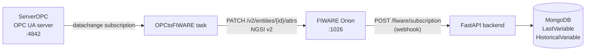

# OPCtoFIWARE Background Task

**Script**: `agrync_backend/tasks/OPCtoFIWARE.py`  
**Task name**: `OPCtoFIWARE`  
**Log file**: `tasks/logOPCtoFIWARE/OPCtoFIWARE.log`  
**Locked**: `True` (started/stopped automatically as a dependency of the Modbus task)

---

## Responsibilities

1. Connects to the running `ServerOPC` OPC UA server as a client.
2. Subscribes to all variable nodes to receive data-change notifications.
3. On every data change, publishes the new value to the **FIWARE Orion Context Broker** as an NGSI v2 attribute update (`PATCH /v2/entities/{entity_id}/attrs`).
4. Handles OPC UA reconnection on server disconnection.

---

## Architecture

---

## NGSI v2 entity mapping

| OPC UA concept | NGSI v2 concept |
|---|---|
| Node string ID: `Device1-Slave1-Temp` | Entity ID: `Device1-Slave1`, attribute name: `Temp` |
| Node value | Attribute value |
| Server timestamp | `metadata.timestamp` ISO8601 |

Entity type is fixed to `"Device"`.

---

## Orion subscription

On startup, the task registers a subscription with Orion so that attribute changes trigger a notification to the FastAPI backend webhook (`POST /api/v1/fiware/subscription`). This closes the loop: OPC → FIWARE → MongoDB.

If the subscription already exists from a previous run, the task reuses it.

---

## Reconnection logic

If the OPC UA connection is lost (server stopped or network error):

1. The task logs a warning.
2. Waits a configurable `RECONNECTION_TIME` seconds.
3. Reconnects and recreates the subscription.

---

## Environment variables (tasks/.env)

| Variable | Description |
|---|---|
| `OPCUA_IP_PORT` | OPC UA server address to subscribe to |
| `URI` | OPC UA namespace URI |
| `CLIENT_CERT` / `PRIVATE_KEY` | Client certificate for secure connection |
| `CERT` | Server certificate (trust anchor) |
| `CLIENT_APP_URI` | OPC UA application URI for the client |
| `USERNAME_OPC_ADMIN` / `PASSWORD_OPC_ADMIN` | OPC UA credentials |
| `ORION_URL` | FIWARE Orion base URL (e.g. `http://orion:1026`) |
| `BACKEND_URL` | FastAPI backend URL for the Orion webhook callback |
| `RECONNECTION_TIME` | Seconds to wait before reconnect |
| `LOG_CONFIG` | Path to `logging.conf` |
