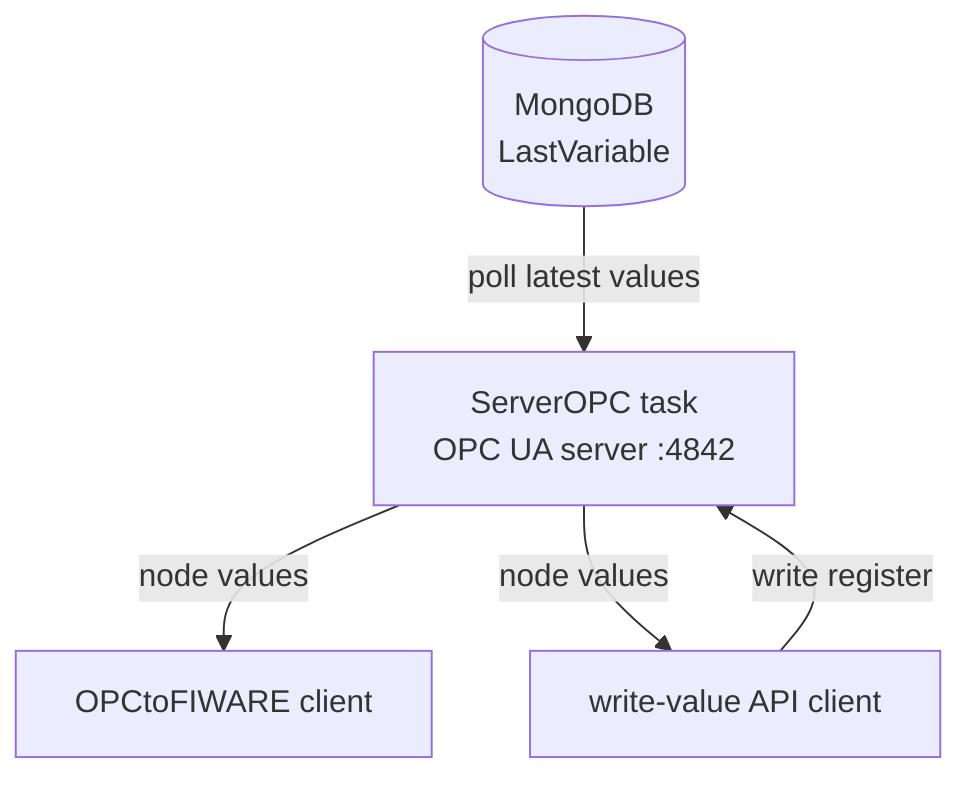

# ServerOPC Background Task

**Script**: `agrync_backend/tasks/ServerOPC.py`  
**Task name**: `ServerOPC`  
**Log file**: `tasks/logServer/ServerOPC.log`  
**Locked**: `True` (started/stopped automatically as a dependency of the Modbus task)

---

## Responsibilities

1. Starts an **OPC UA server** using the `asyncua` library, listening on port `4842`.
2. Populates the OPC UA address space with one node per Modbus variable.
3. Periodically reads the latest values from `LastVariable` in MongoDB and updates the OPC UA node values.
4. Accepts OPC UA client connections from the `OPCtoFIWARE` task and the `/opc/write-value` API endpoint.

---

## Architecture

---

## Address space

All variable nodes are created under a custom namespace URI (configured via `URI` env var). Each node is identified by the string `{Device}-{Slave}-{Variable}`.

Node access levels:

| Variable `writable` | OPC UA access level |
|---|---|
| `False` | Read-only |
| `True` | Read + Write |

---

## Security

The OPC UA server uses certificate-based security:

- **Security policy**: `Basic256Sha256`
- **Message security mode**: `SignAndEncrypt`
- **Certificate**: `tasks/certificate/my_cert.der`
- Clients must present a trusted certificate to connect.

User authentication is enforced via OPC UA username/password (admin credentials from `tasks/.env`).

---

## Lifecycle

On startup, the script:

1. Connects to MongoDB and initialises Beanie.
2. Loads all `ModbusDevice` documents to build the address space.
3. Starts the OPC UA server.
4. Enters an update loop: reads `LastVariable` for each variable and sets the corresponding OPC UA node value.

On shutdown (SIGTERM), the server is stopped gracefully.

---

## Environment variables (tasks/.env)

| Variable | Description |
|---|---|
| `OPCUA_IP_PORT` | OPC UA server bind address (e.g. `0.0.0.0:4842`) |
| `URI` | OPC UA namespace URI |
| `CERT` | Path to server certificate |
| `PRIVATE_KEY` | Path to server private key |
| `USERNAME_OPC_ADMIN` / `PASSWORD_OPC_ADMIN` | OPC UA admin credentials |
| `LOG_CONFIG` | Path to `logging.conf` |
