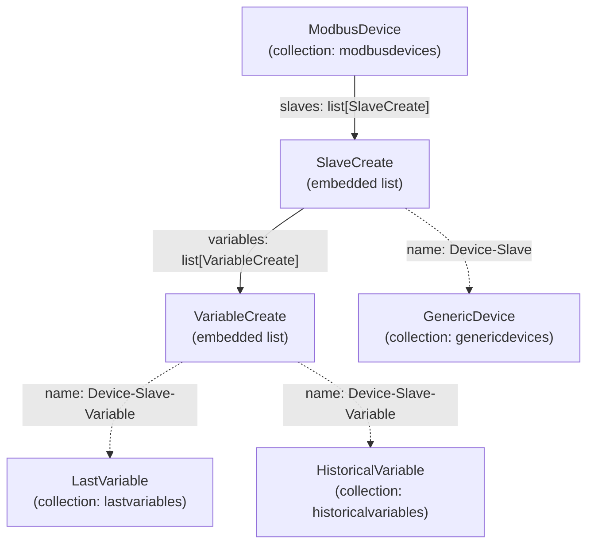

# Modbus Data Models

The Modbus configuration uses a **single embedded document** design — one `ModbusDevice` document contains all its slaves, and each slave contains all its variables. There are no separate slave or variable collections.

## Document hierarchy

Dashed arrows represent the naming convention used as a lookup key across collections. There are no MongoDB foreign-key references.

---

## ModbusDevice

MongoDB collection: `modbusdevices`

| Field | Type | Notes |
|---|---|---|
| `name` | str | Unique, no spaces |
| `ip` | str (IPv4) | Validated by Pydantic `field_validator` |
| `slaves` | list[SlaveCreate] | Embedded subdocuments |
| `createdAt` | datetime | UTC |
| `updatedAt` | datetime | UTC |

**Class methods**:

| Method | Description |
|---|---|
| `by_ip(ip)` | Find device by IP |
| `check_by_name(name)` | Check if name exists (bool) |
| `find_slave_by_name(name)` | Return embedded slave by name |
| `find_variable_by_name(name, name_slave)` | Return embedded variable by name within a slave |
| `check_slave_by_slave_id(slave_id)` | Check if slave_id is already used |
| `check_variable_by_address(address, name_slave)` | Check if address is already used in a slave |

---

## SlaveCreate (embedded)

| Field | Type | Default | Constraints |
|---|---|---|---|
| `name` | str | — | No spaces, unique within device |
| `slave_id` | int | — | 1–247 |
| `variables` | list[VariableCreate] | `[]` | Embedded |
| `createdAt` | datetime | now | — |
| `updatedAt` | datetime | now | — |

---

## VariableCreate (embedded)

| Field | Type | Default | Constraints |
|---|---|---|---|
| `name` | str | — | No spaces, unique within slave |
| `type` | DataType | `Float32` | Enum: `Float32`, `Int16`, `UInt16`, `Int32`, `UInt32`, `String` |
| `address` | int | — | **0-based** (stored as `input - 1`) |
| `scaling` | float \| None | `None` | Multiply raw value before storing |
| `decimals` | int | `0` | 0–6 |
| `endian` | str | `"Big"` | `"Big"` or `"Little"` |
| `interval` | int | `5` | Polling interval in seconds (≥ 1) |
| `length` | int \| None | `None` | Registers to read; required for `String` |
| `writable` | bool | `False` | Exposes write form on Dashboard |
| `min_value` | float \| None | `None` | Alarm lower bound |
| `max_value` | float \| None | `None` | Alarm upper bound |
| `unit` | str \| None | `None` | Engineering unit label |
| `createdAt` | datetime | now | — |
| `updatedAt` | datetime | now | — |

!!! note "Immutable fields after creation"
    `name`, `type`, and `address` cannot be changed via `PUT`. If these need to change, delete and recreate the variable.

---

## GenericDevice

MongoDB collection: `genericdevices`

Acts as the shared identity layer for device-slave pairs. Name format: `{Device}-{Slave}`.

| Field | Type | Notes |
|---|---|---|
| `name` | str | `{Device}-{Slave}` composite |
| `type` | DeviceType | `modbus` (enum) |
| `variables` | list[VariableAtributes] | Mirrors the variable metadata needed by Dashboard/OPC |

`VariableAtributes` stores `name`, `type`, `scaling`, `decimals`, `min_value`, `max_value`, `unit`, `writable` — a subset of `VariableCreate`.

---

## LastVariable

MongoDB collection: `lastvariables`

| Field | Type | Notes |
|---|---|---|
| `name` | str | `{Device}-{Slave}-{Variable}` |
| `value` | float \| int \| None | Most recent reading |
| `timestamp` | datetime \| None | When the reading was taken |

---

## HistoricalVariable

MongoDB collection: `historicalvariables`

One document per variable per calendar day.

| Field | Type | Notes |
|---|---|---|
| `name` | str | `{Device}-{Slave}-{Variable}` |
| `day` | date | Calendar date (UTC) |
| `values` | list[ValueWithTimestamp] | All readings for that day |

`ValueWithTimestamp`: `{ value: float | int, timestamp: datetime }`
