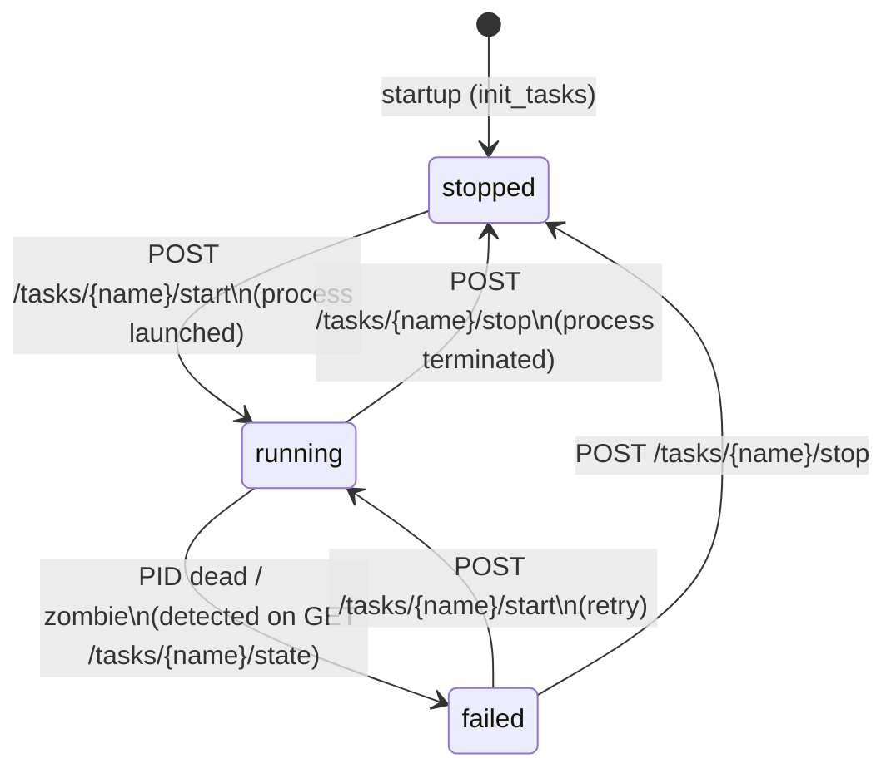

# Tasks Data Model

## Enums

### State

```python
class State(str, Enum):
    running = "running"
    stopped = "stopped"
    failed  = "failed"
```

### NameTask

```python
class NameTask(str, Enum):
    serverOPC   = "ServerOPC"
    modbus      = "Modbus"
    opcToFiware = "OPCtoFIWARE"
```

---

## Task (Beanie Document)

MongoDB collection: `tasks`

Three records exist at all times — one per `NameTask` value. They are created (or reset to `stopped`) during application startup.

| Field | Type | Default | Notes |
|---|---|---|---|
| `name` | NameTask | — | Unique index |
| `pid` | int \| None | `None` | OS process ID when running |
| `state` | State | `stopped` | `running` / `stopped` / `failed` |
| `locked` | bool | `False` | `True` for `ServerOPC` and `OPCtoFIWARE` |
| `createdAt` | datetime | now | — |
| `updatedAt` | datetime | now | — |

### locked flag

| Task | locked | Meaning |
|---|---|---|
| `Modbus` | `False` | Can be started/stopped directly |
| `ServerOPC` | `True` | Only started/stopped as dependency of Modbus |
| `OPCtoFIWARE` | `True` | Only started/stopped as dependency of Modbus |

---

## State machine



---

## Class methods

| Method | Description |
|---|---|
| `by_name(name)` | Find one task by `NameTask` |
| `create_task(name)` | Create a new task record; sets `locked=True` for `ServerOPC` and `OPCtoFIWARE` |
| `any_locked_running()` | Returns `True` if any locked task is in `running` state |
| `any_unlocked_running()` | Returns `True` if any unlocked task is in `running` state |
| `get_all_locked()` | Returns the list of all locked `Task` documents |
| `update_state(new_state, pid)` | Updates state + pid + `updatedAt` |
| `stop_task()` | Shortcut: sets state to `stopped` and `pid` to `None` |
| `fail_task()` | Shortcut: sets state to `failed` |
| `start_task(pid)` | Shortcut: sets state to `running` with the given PID |

---

## TaskState (response model)

Used by `GET /tasks/{name}/state`:

```python
class TaskState(BaseModel):
    state:  State
    locked: bool
```
