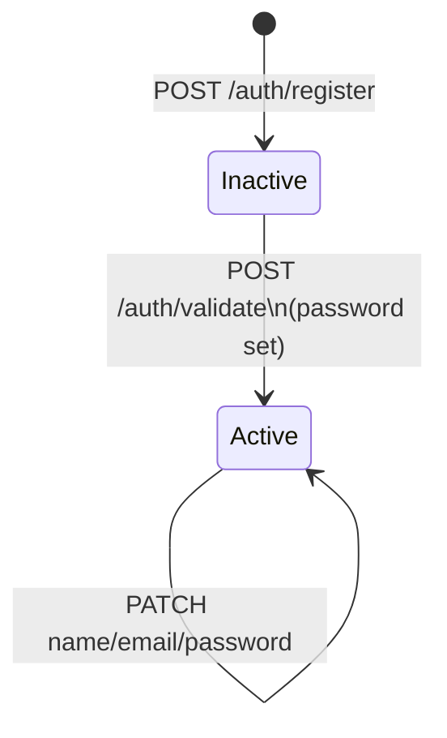

# User & Roles Models

## Role enum

```python
class Role(str, Enum):
    admin  = "Administrador"
    viewer = "Lector"        # reserved, not yet exposed in UI
    editor = "Editor"
```

## User (Beanie Document)

MongoDB collection: `users`

```python
class User(Document, UserForm):
    email:     Annotated[EmailStr, Indexed(unique=True)]
    password:  str | None = None       # bcrypt hash; None until activation
    active:    bool = False            # False until POST /auth/validate
    devices:   list[str] | None = None # device-slave names assigned to user
    createdAt: datetime
    updatedAt: datetime
```

| Field | Type | Notes |
|---|---|---|
| `email` | EmailStr | Unique index |
| `full_name` | str | Inherited from `UserForm` |
| `role` | Role | `Administrador` \| `Editor` |
| `password` | str \| None | bcrypt hash. `None` for newly created, inactive users |
| `active` | bool | `False` until account activated via `/auth/validate` |
| `devices` | list[str] \| None | List of `{Device}-{Slave}` composite names |
| `createdAt` | datetime | UTC, set on creation |
| `updatedAt` | datetime | UTC, updated on every write |

**Index**: `devices` field is indexed to support the query `find_by_device_name`.

### Key class methods

| Method | Description |
|---|---|
| `by_email(email)` | Find one user by email (`find_one`) |
| `find_by_device_name(device_name)` | Return all users with that device in their `devices` list |

---

## Request / response Pydantic models

| Model | Fields | Used by |
|---|---|---|
| `UserForm` | `email`, `full_name`, `role` | `POST /auth/register`, `PUT /users/{id}` |
| `UserAuthForm` | `email`, `password`, `password_confirmation` | `POST /auth/validate` |
| `UserName` | `full_name` | `PATCH /users/{id}/name` |
| `UserChangePassword` | `password`, `new_password`, `new_password_confirmation` | `PATCH /users/{id}/password` |
| `UserChangeEmail` | `email`, `new_email`, `new_email_confirmation` | `PATCH /users/{id}/email` |
| `UserByToken` | `id`, `full_name`, `role` | Injected by `get_current_user` dependency |
| `UserList` | All `User` fields + `id` | `POST /users/list` response items |
| `UsersResponseList` | `data: list[UserList]`, `totalRowCount: int` | `POST /users/list` response |

---

## Activation state machine



An inactive user (`active = False`, `password = None`) cannot log in. The `authenticate_user` function raises `401` if `active == False`.
