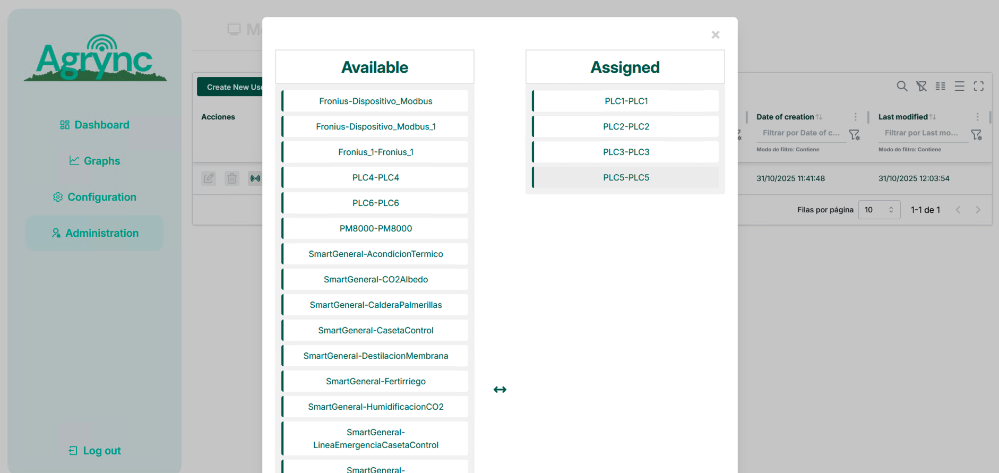
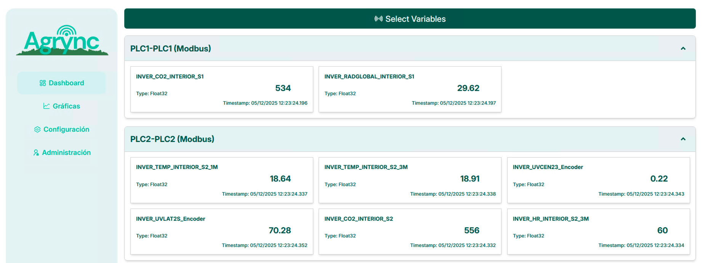

# Dashboard

The **Dashboard** page displays live-value cards for any combination of Modbus variables. Each card shows the most recent reading for a single variable and refreshes automatically.

!!! info "Data availability"
    Cards only show values that have already been collected by the **Modbus** task. If a variable has never been polled the card will show no data.

---

## Selecting variables to display

1. Go to **Dashboard**.
2. Click the **Configure** button (or a similar controls icon in the toolbar).

    <!-- screenshot: Dashboard toolbar with the Configure/select-variables button highlighted -->
    

3. A modal dialog opens listing all the Modbus devices assigned to your account. Under each device the available variables are shown as checkboxes.

    <!-- screenshot: variable-selection modal with device headings and variable checkboxes -->
    
    *Select one or more variables from any device.*

4. Check the variables you want to monitor.
5. Click **Save**.

The modal closes and the dashboard renders one card per selected variable.

---

## Reading a value card

Each card contains:

| Element | Description |
|---|---|
| **Device name** | The name of the Modbus device that owns the variable. |
| **Variable name** | The configured name of the variable. |
| **Last value** | The most recent reading stored in the database. |
| **Timestamp** | The date and time when that reading was taken. |
| **Unit** | The engineering unit configured for the variable (e.g. `°C`, `bar`, `rpm`). |

<!-- screenshot: two or three live value cards with realistic values and timestamps -->

*Live value cards updating automatically.*

The dashboard polls for new values at a fixed interval. The page does not need to be manually refreshed.

---

## Writing a value (OPC UA)

If a variable is writable and your account has the **Administrator** or **Editor** role, a write form appears at the bottom of the card.

<!-- screenshot: a value card with the write-value input and Submit button visible -->

*Write-value form for a writable variable.*

To write a value:

1. Enter the new value in the input field.
2. Click **Submit** (or **Write**).
3. A confirmation toast is shown if the write was accepted by the OPC UA server.

!!! warning "OPC UA server must be running"
    Writing values requires the **ServerOPC** task to be in the **Running** state. If it is stopped or failed, write operations will return an error.

!!! info "Viewer accounts"
    Users with a read-only role do not see the write form.

---

## Changing the card selection

Click **Configure** again at any time to add or remove variables. The updated selection is applied immediately.
