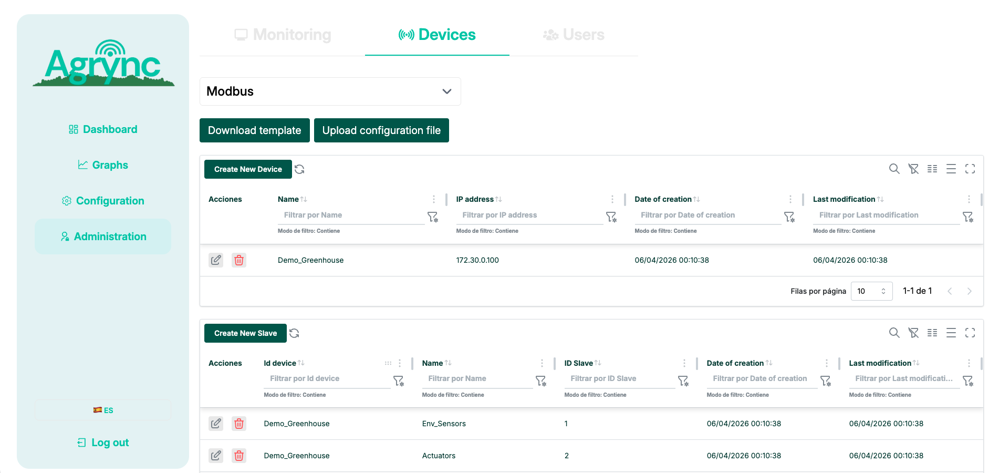
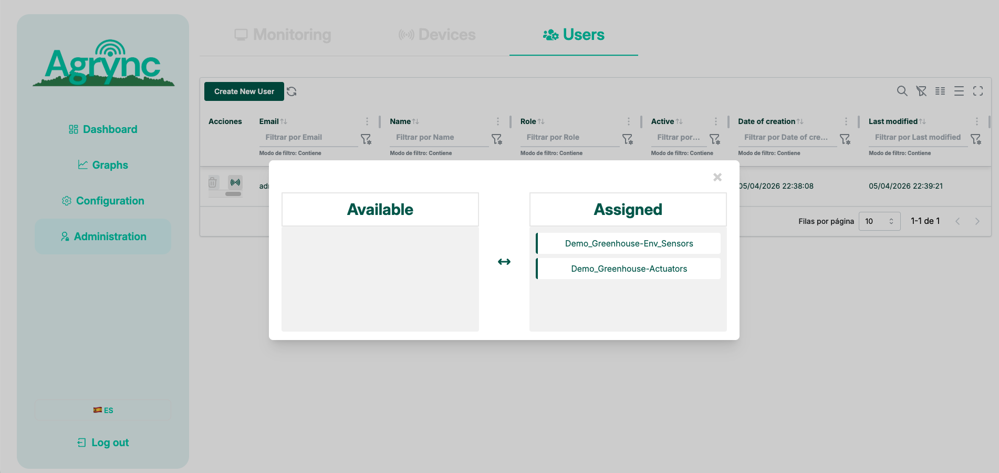
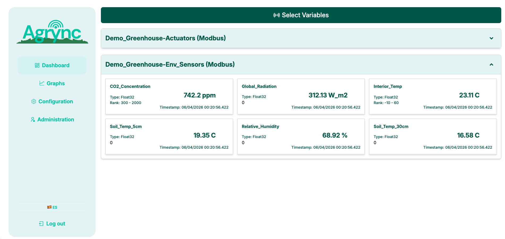
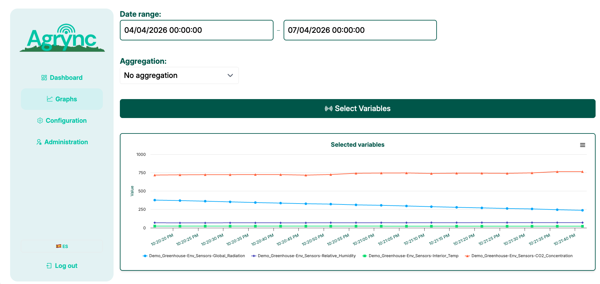

# Demo Mode

Agrync ships with a self-contained **demo stack** that lets you evaluate the full platform without any physical Modbus hardware, OPC-UA certificates, or external services.  
A virtual greenhouse PLC is simulated in software, and the entire IoT pipeline runs inside Docker on a laptop.

---

## How the demo works

In production, Agrync's data pipeline is:

```
Modbus TCP device → OPC-UA Server → OPC-to-FIWARE task → FIWARE Orion → FastAPI webhook → MongoDB ← Frontend
```

In demo mode the OPC-UA layer is **completely replaced** by a lightweight built-in simulator:

```
Modbus Simulator (Docker) → demo_task poller → FIWARE Orion → FastAPI webhook → MongoDB ← Frontend
```

Two extra Docker services are added on top of the normal stack:

| Service | Role |
|---|---|
| `modbus_simulator` | Modbus TCP server simulating a greenhouse PLC with a realistic day/night cycle (24 min ≈ 1 simulated day). |
| `modbus_demo_task` | Reads the simulator, pushes data to FIWARE Orion and then to MongoDB. Replaces the Modbus + ServerOPC + OPCtoFIWARE tasks. |

---

## Prerequisites

- [Docker Desktop](https://www.docker.com/products/docker-desktop/) (or Docker Engine + Compose plugin)
- Ports **5173**, **8000**, **1026**, **27020**, and **5020** free on localhost

---

## Quick start

### 1. Copy the environment file

```bash
cp .env.demo.example .env.demo
```

The defaults work as-is for a local demo. The only secret is the JWT signing key — change it if you expose the service on a network.

### 2. Start the stack

```bash
docker-compose -f docker-compose.yml -f docker-compose.demo.yml up --build
```

All six containers start: `mongodb`, `orion`, `agrync_backend`, `agrync_frontend`, `modbus_simulator`, `modbus_demo_task`.  
Wait until the frontend prints `VITE … ready in …` before opening the browser.

### 3. Activate the admin account

Open [http://localhost:5173/create-password](http://localhost:5173/create-password) and set a password for `admin@agrync-demo.com`. No REST API call is required — account activation is handled entirely through the web form.


!!! tip
    The demo uses `Demo1234!` as the example password in this guide. Choose any password that meets the minimum requirements.

### 4. Log in

Open [http://localhost:5173/login](http://localhost:5173/login) and log in with:

- **Email:** `admin@agrync-demo.com`
- **Password:** *(the password you just set)*

### 5. Import the demo device

1. Go to **Administration → Devices**.
2. Click **Upload** (bulk import).
3. Select the file `modbus_simulator/demo_devices.json` from the project root.
4. Confirm the import.

This creates the device **Demo_Greenhouse** with two Modbus slaves:

| Slave | Variables |
|---|---|
| `Env_Sensors` (id = 1) | Interior_Temp, Relative_Humidity, CO2_Concentration, Global_Radiation, Soil_Temp_5cm, Soil_Temp_30cm |
| `Actuators` (id = 2) | Zenith_Ventilation, Lateral_Ventilation, Thermal_Screen, Active_Irrigation |



### 6. Assign the device to the admin user

1. Go to **Administration → Users**.
2. Click the **Devices** button next to `admin@agrync-demo.com`.
3. Move **Demo_Greenhouse** from *Available* to *Assigned*.
4. Click **Save**.

This step demonstrates Agrync's role-based device access — each user only sees the devices assigned to them.



### 7. View live data

Open the **Dashboard**. Sensor cards appear immediately with values updating every 5 seconds.



### 8. Explore historical data

Open the **Graphs** section. Select a date range, choose one or more variables, and the chart renders historical trends from the data already collected by the simulator.



---

## The simulated greenhouse

The simulator generates realistic sensor data driven by a sun-intensity curve that completes one full day/night cycle every **24 minutes** (60× real-time speed).

| Variable | Type | Range |
|---|---|---|
| `Interior_Temp` | Float32 | 14 – 36 °C |
| `Relative_Humidity` | Float32 | 40 – 90 % |
| `CO2_Concentration` | Float32 | 400 – 900 ppm |
| `Global_Radiation` | Float32 | 0 – 800 W/m² |
| `Soil_Temp_5cm` | Float32 | 12 – 28 °C |
| `Soil_Temp_30cm` | Float32 | 11 – 22 °C |
| `Zenith_Ventilation` | UInt16 | 0 / 1 (opens at high temp) |
| `Lateral_Ventilation` | UInt16 | 0 / 1 (opens at high temp) |
| `Thermal_Screen` | UInt16 | 0 / 1 (closes at night) |
| `Active_Irrigation` | UInt16 | 0 / 1 (on at midday) |

---

## Verifying data in FIWARE Orion

FIWARE Orion is the message broker at the centre of the integration pipeline. The `modbus_demo_task` service pushes every sensor reading as a normalised NGSIv2 entity. You can query Orion directly from a terminal while the demo is running — all requests require the `Fiware-Service: demo` header.

### List all entities

```bash
curl -s \
  -H "Fiware-Service: demo" \
  -H "Fiware-ServicePath: /" \
  http://localhost:1026/v2/entities | python3 -m json.tool
```

### Environmental sensors entity

```bash
curl -s \
  -H "Fiware-Service: demo" \
  -H "Fiware-ServicePath: /" \
  "http://localhost:1026/v2/entities/Demo_Greenhouse-Env_Sensors" | python3 -m json.tool
```

Expected attributes: `Interior_Temp`, `Relative_Humidity`, `CO2_Concentration`, `Global_Radiation`, `Soil_Temp_5cm`, `Soil_Temp_30cm`.

### Actuators entity

```bash
curl -s \
  -H "Fiware-Service: demo" \
  -H "Fiware-ServicePath: /" \
  "http://localhost:1026/v2/entities/Demo_Greenhouse-Actuators" | python3 -m json.tool
```

Expected attributes: `Zenith_Ventilation`, `Lateral_Ventilation`, `Thermal_Screen`, `Active_Irrigation`.

### Example response fragment

```json
{
  "id": "Demo_Greenhouse-Env_Sensors",
  "type": "modbus",
  "Interior_Temp": {
    "type": "Number",
    "value": 24.87,
    "metadata": {
      "timestamp": { "type": "DateTime", "value": "2026-04-05T20:15:00.000Z" }
    }
  },
  ...
}
```

Each attribute value refreshes every 5 seconds. The same data is forwarded by Orion to the FastAPI backend via a subscription, persisted in MongoDB, and visualised in the Dashboard.

!!! info "Production data flow comparison"
    In the production stack, the equivalent path is longer:
    `Modbus device → OPC-UA Server (port 4842) → OPCtoFIWARE task → FIWARE Orion → backend webhook → MongoDB`.
    The demo bypasses OPC-UA entirely. The result in FIWARE and MongoDB is identical.

---

## Monitoring section in demo mode

The **Administration → Monitoring** panel controls the OPC-UA background tasks (*Modbus*, *ServerOPC*, *OPCtoFIWARE*).  
In demo mode those tasks are **not used** — the `modbus_demo_task` container handles data acquisition instead.

A yellow banner is shown on each monitoring page to explain this:

> *Demo mode: the OPC-UA pipeline (Modbus task, ServerOPC, OPCtoFIWARE) is replaced by the built-in simulator. These controls are disabled in demo.*

The service status shown (*Unknown*, *Failed*) is expected and does not indicate a problem.

---

## Stopping the demo

```bash
docker-compose -f docker-compose.yml -f docker-compose.demo.yml down
```

To also remove the MongoDB data volume (fresh start):

```bash
docker-compose -f docker-compose.yml -f docker-compose.demo.yml down -v
```
