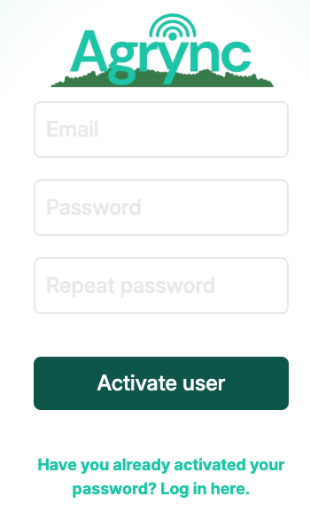
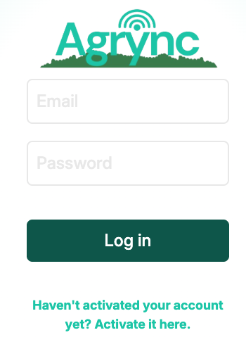
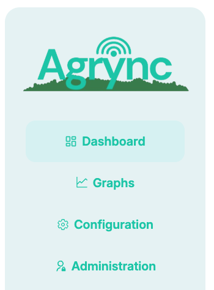

# First Steps

## Activating your account

New user accounts are created by an administrator (see [User Management](user-management.md)). When an account is created, the user receives an email with a temporary link to set their password.

Open the activation link in your browser. You will land on the **Set password** page:

<!-- screenshot: the CreatePassword page showing the activation form with email, password and confirm-password fields -->

*The account activation page. Enter your email and choose a password.*

Fill in the fields:

| Field | Description |
|---|---|
| **Email** | The email address the administrator used to create your account. |
| **Password** | Choose a strong password (minimum 8 characters). |
| **Repeat password** | Type your new password again to confirm. |

Click **Activate account**. If the token in the URL has not expired and both passwords match, your account is activated and you are redirected to the login page.

!!! warning "Activation link expiry"
    The activation link is single-use and time-limited. If it has expired, ask your administrator to resend the invitation.

---

## Logging in

Navigate to http://localhost:5173/login (or the URL provided by your administrator).

<!-- screenshot: the Login page showing the email and password fields and the Log in button -->

*The login page. Enter your email address and password.*

Enter your **email** and **password** and click **Log in**.

On success you are redirected to the **Dashboard**. A confirmation toast appears briefly at the bottom-right of the screen.

### Login errors

| Error shown | Cause |
|---|---|
| *Email is required* | The email field was left empty. |
| *Password is required* | The password field was left empty. |
| *Invalid email address* | The email does not match a valid format. |
| *Incorrect email or password* | The credentials do not match any account. |

---

## Navigating the application

After logging in, the main navigation menu is always visible on the left side of the screen.

<!-- screenshot: the full app layout showing the left sidebar menu with all navigation items visible -->

*The main navigation menu with all available sections.*

| Section | Description |
|---|---|
| **Dashboard** | Live view of your sensor variables. |
| **Charts** | Historical charts with date range and aggregation. |
| **Configuration** | Your profile and account credentials. |
| **Administration** | Monitoring tasks, device configuration, and user management *(administrators only)*. |

---

## Logging out

Click your user name or the logout button at the bottom of the navigation menu. You are redirected to the login page and your session token is invalidated.
