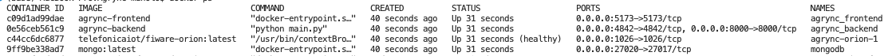

# Installation

## Prerequisites

| Requirement | Minimum version | Notes |
|---|---|---|
| Docker | 24.0 | Required for the recommended setup |
| Docker Compose | 2.20 | Included with Docker Desktop |
| Git | any | To clone the repository |

For local development without Docker:

| Requirement | Minimum version |
|---|---|
| Python | 3.13 |
| Node.js | 22 |
| MongoDB | 7.0 |

## Recommended setup — Docker Compose

This is the easiest way to run the complete stack (backend, frontend, database, and FIWARE Orion).

**1. Clone the repository**

```bash
git clone https://github.com/ManuelMuRodriguez/Agrync.git
cd Agrync
```

**2. Configure environment variables**

The backend reads its configuration from environment variables. Create a `.env` file at the repository root:

```bash
# .env
MONGO_URI=mongodb://mongodb:27017
SECRET_KEY=change-this-to-a-long-random-string
ALGORITHM=HS256
ACCESS_TOKEN_EXPIRE_MINUTES=30
REFRESH_TOKEN_EXPIRE_DAYS=7
```

!!! warning "Security"
    Never commit your `.env` file to version control. The repository `.gitignore` already excludes it.

**3. Start the stack**

```bash
docker compose up --build
```

Docker Compose will download all required images, build the backend and frontend containers, and start the following services:

| Service | URL | Description |
|---|---|---|
| Frontend | http://localhost:5173 | React web application |
| Backend API | http://localhost:8000/api/v1 | FastAPI REST API |
| API docs | http://localhost:8000/api/v1/docs | Interactive Swagger UI |
| MongoDB | localhost:27020 | Database (internal use) |
| FIWARE Orion | http://localhost:1026 | Context Broker (optional) |

<!-- screenshot: terminal output of docker compose up showing all services healthy -->

*All services starting correctly with `docker compose up --build`.*

**4. Stop the stack**

```bash
docker compose down
```

## Local development setup

### Backend

```bash
cd agrync_backend
python -m venv .venv
source .venv/bin/activate      # On Windows: .venv\Scripts\activate
pip install -r requirements.txt
```

Create a `.env` file inside `agrync_backend/` with the variables listed above (use `MONGO_URI=mongodb://localhost:27017`), then run:

```bash
uvicorn main:app --host 0.0.0.0 --port 8000 --reload
```

### Frontend

```bash
cd agrync_frontend
npm install
npm run dev
```

The development server starts at http://localhost:5173 and hot-reloads on every file save.

## First-time initialisation

When the backend starts for the first time against an empty database, it automatically creates a default administrator account:

| Field | Value |
|---|---|
| Email | `admin@admin.com` |
| Role | Administrator |
| Password | *(set on first login — see [First Steps](first-steps.md))* |

!!! danger "Change the default credentials"
    Set a strong password for this account immediately after the first login.
