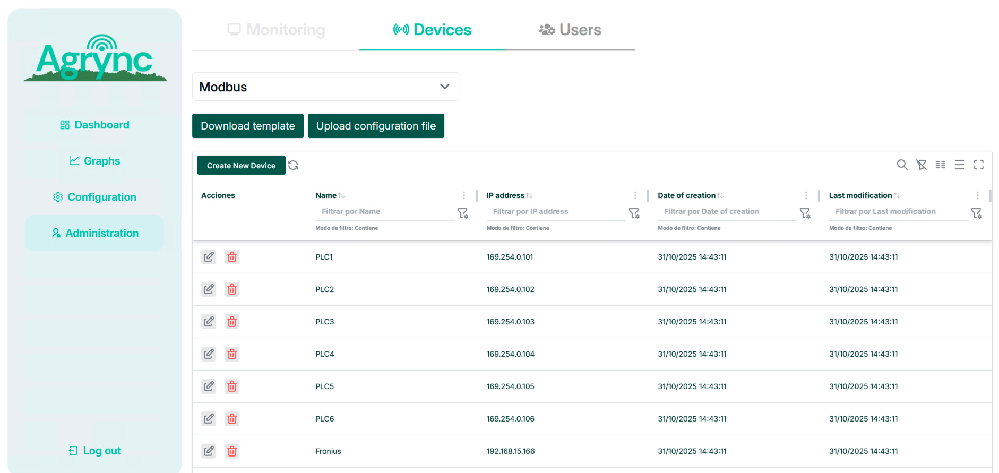

# Devices

A **device** represents a physical Modbus TCP/IP gateway or PLC. It is identified by its IP address, which must be unique across the system.

## Viewing devices

The devices table is at the top of the **Administration → Devices → Modbus** page. It shows all registered devices and supports filtering, sorting, and pagination.

<!-- screenshot: the ModbusDevicesTable component showing a list of devices with their IP addresses and action buttons -->

*The devices table. Each row shows the device name and IP address.*

## Adding a device

1. Click the **Add device** button above the devices table.
2. Fill in the form:

| Field | Required | Rules |
|---|:---:|---|
| **Name** | ✅ | Letters, digits, `_`, `.`, `-`. No hyphens at the start or end. |
| **IP address** | ✅ | Valid IPv4 address (e.g. `192.168.1.10`). Must be unique. |

3. Click **Save**. The new device appears in the table.

<!-- screenshot: the add-device modal/form with the Name and IP fields filled in -->

*The add-device form.*

!!! note
    Adding a device does not start data collection. You need to add at least one slave and one variable, and then start the **Modbus task** (see [Modbus Task](../monitoring/modbus-task.md)).

## Editing a device

Click the **Edit** (pencil) icon on any row to open the edit form. You can update the name and IP address. Click **Save** to apply the changes.

!!! warning "Renaming a device"
    Renaming a device also renames all internal references (slaves, variables, and stored data) to keep the hierarchy consistent.

## Deleting a device

Click the **Delete** (bin) icon on the device row and confirm the action. Deleting a device also deletes all of its slaves and variables.

!!! danger
    This action is irreversible. All historical data associated with the device's variables is also removed.
