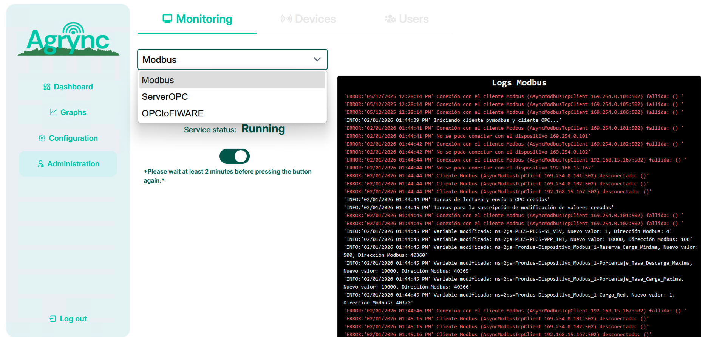

# Modbus Task

The **Modbus** task polls all Modbus devices and slaves configured in Agrync and stores their variable readings in the database. It is **unlocked**, meaning it can run at the same time as the ServerOPC or OPCtoFIWARE tasks.

---

## Starting the Modbus task

1. Go to **Administration → Monitoring → Modbus**.
2. The current state of the task is displayed (Stopped / Running / Failed).
3. Click **Start**.

<!-- screenshot: Modbus task page with state "Stopped" and the Start button highlighted -->

*Modbus task ready to start.*

If the task starts successfully, the state changes to **Running** and the log panel begins streaming output.

<!-- screenshot: Modbus task page with state "Running" and the live log panel showing log lines -->

*Modbus task running, log streaming live.*

---

## Stopping the Modbus task

1. Go to **Administration → Monitoring → Modbus**.
2. Click **Stop**.
3. The state changes to **Stopped** and log streaming ends.

!!! warning
    Stopping the Modbus task interrupts data collection. No new readings are stored until the task is restarted.

---

## Task state: Failed

If the Modbus task transitions to **Failed**:

1. Review the log panel for the error message.
2. Common causes:
    - A Modbus device is unreachable (wrong IP address or port).
    - A slave ID is misconfigured.
    - A variable has an unsupported register address for the target device.
3. Fix the configuration under **Administration → Modbus**.
4. Click **Start** to retry.

---

## Live log

When the task is running, the log panel streams output in real time via a WebSocket connection. Each line is prefixed with a timestamp and severity level.

<!-- screenshot: Modbus log panel showing timestamped log lines such as INFO read, DEBUG value, ERROR connection -->

*Live log lines for the Modbus task.*

Log lines use standard levels: `DEBUG`, `INFO`, `WARNING`, `ERROR`, `CRITICAL`.

The underlying log file is stored at `tasks/logModbus/Modbus.log` inside the backend container. Previous rotated logs are retained with numeric suffixes (`.log.1`, `.log.2`, …).
