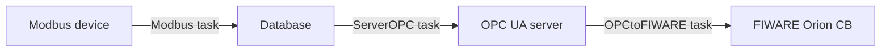

# OPCtoFIWARE Task

The **OPCtoFIWARE** task subscribes to the OPC UA server (ServerOPC) and forwards variable-value updates to a **FIWARE Orion Context Broker** as context entity attributes. This closes the pipeline from field device to FIWARE.

This task is **locked**: only one locked task can run at a time. If **ServerOPC** is already running, you must stop it before starting OPCtoFIWARE.

!!! warning "ServerOPC must be running first"
    OPCtoFIWARE depends on the OPC UA server. Always start **ServerOPC** before starting OPCtoFIWARE. If ServerOPC is not running, OPCtoFIWARE will fail immediately.

---

## Starting the OPCtoFIWARE task

1. Verify that **ServerOPC** is in the **Running** state (see [ServerOPC Task](server-opc-task.md)).
2. Go to **Administration → Monitoring → OPCtoFIWARE**.
3. Verify the current state is **Stopped**.
4. Click **Start**.

If the task starts successfully, the state changes to **Running** and the log panel begins streaming.

---

## Stopping the OPCtoFIWARE task

1. Go to **Administration → Monitoring → OPCtoFIWARE**.
2. Click **Stop**.
3. The state changes to **Stopped**. No more updates are forwarded to FIWARE Orion.

---

## Task state: Failed

If OPCtoFIWARE transitions to **Failed**:

1. Check the live log for error messages.
2. Common causes:

    | Cause | Resolution |
    |---|---|
    | ServerOPC is not running | Start ServerOPC first, then restart OPCtoFIWARE |
    | FIWARE Orion URL is wrong | Check the `ORION_URL` environment variable in `docker-compose.yml` |
    | FIWARE Orion is unreachable | Verify that the Orion container is running and the network allows the connection |
    | OPC UA subscription error | Verify ServerOPC is healthy and retry |

3. After resolving the issue, click **Start** to retry.

---

## Live log

The log panel streams output in real time via a WebSocket connection when the task is running.

The underlying log file is stored at `tasks/logOPCtoFIWARE/OPCtoFIWARE.log` inside the backend container. Previous rotated logs are retained with numeric suffixes.

---

## Full pipeline summary

## Full pipeline summary

The following diagram shows the data flow from Modbus device to FIWARE Orion:

All three tasks must be running for end-to-end FIWARE integration to be active.
