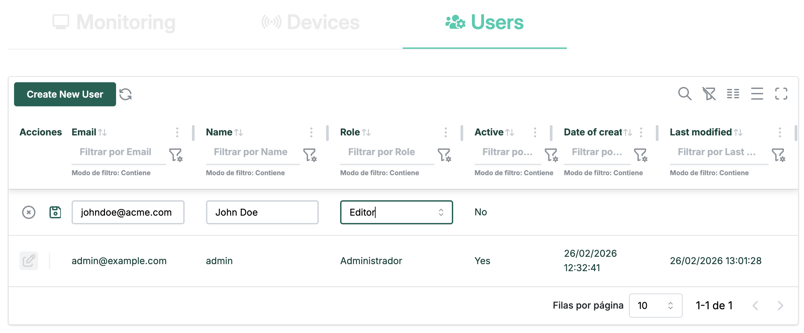
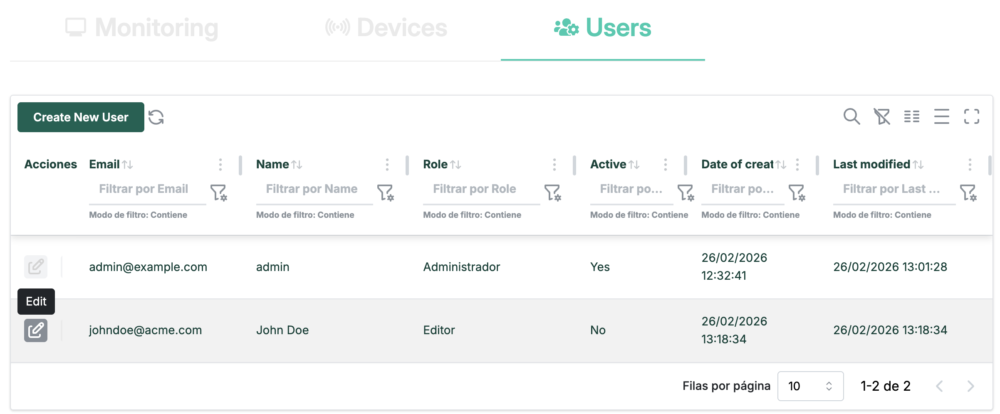

# User Management

!!! info "Administrator only"
    All actions on this page require the **Administrator** role.

The **User Management** section lets administrators create and manage Agrync user accounts and control which Modbus devices each user can access.

Navigate to **Administration → Users**.

---

## User list

The page displays a table of all registered users with the following columns:

| Column | Description |
|---|---|
| **Name** | Full name of the user. |
| **Email** | Login email address. |
| **Role** | `Administrator` or `Editor`. |
| **Actions** | Edit, device assignment, and delete buttons. |

<!-- screenshot: user list table with at least three rows and action buttons visible -->

*List of registered users.*

---

## Creating a user

1. Click **Add User** (or **New User**) at the top of the user list.
2. Fill in the form:

    | Field | Required | Notes |
    |---|---|---|
    | **Name** | Yes | Full name displayed in the UI. |
    | **Email** | Yes | Must be unique. Used as the login username. |
    | **Role** | Yes | `Administrator` or `Editor`. See [User Roles](user-roles.md). |
    | **Password** | Yes | Temporary password. The user should change it on first login (see [Account Settings](account.md)). |

3. Click **Create**.

<!-- screenshot: create-user form with all fields filled in -->

*Create-user form.*

The new user appears in the list immediately.

---

## Editing a user

You can update the **name** and **role** of an existing user.

1. Click the **Edit** (pencil) icon next to the user.
2. Modify the **Name** and/or **Role** fields.
3. Click **Save**.

!!! note
    Email and password changes are managed separately. See [assigning devices](#assigning-devices) for device access changes.

<!-- screenshot: edit-user form with name and role fields -->

---

## Changing a user's email

1. Click the **Edit** icon next to the user.
2. Look for the **Change Email** sub-form or tab.
3. Enter the **new email** and **confirm new email**.
4. Click **Save**.

---

## Resetting a user's password

1. Click the **Edit** icon next to the user.
2. Look for the **Change Password** sub-form or tab.
3. Enter and confirm the **new password**.
4. Click **Save**.

!!! tip
    For security, inform the user verbally and ask them to change the password immediately via [Account Settings](account.md).

---

## Assigning devices

Device assignment controls which Modbus devices a user can see on the Dashboard and Charts pages.

1. Click the **Devices** (or assign icon) button next to the user.
2. A modal opens with two panels:
    - **Assigned devices** — devices currently accessible to this user.
    - **Available devices** — all devices in the system not yet assigned.
3. Use the checkboxes (or drag-and-drop) to move devices between panels.
4. Click **Save**.

<!-- screenshot: device assignment modal with two panels and checkboxes -->

*Device assignment modal.*

!!! note
    Administrators always see all devices regardless of device assignment.

---

## Deleting a user

1. Click the **Delete** (trash) icon next to the user.
2. A confirmation dialog appears.
3. Click **Confirm**.

The user account and all of their device assignments are removed immediately.

!!! warning
    This action is irreversible. The user will not be able to log in after deletion.
